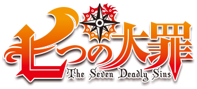

<p align="center">
  
</p>

<h1 align="center">⚔️ Sass-No-Taizai ⚔️</h1>

<p align="center">
  <strong>Un framework legendario inspirado en los Siete Pecados Capitales para dominar el diseño web con el poder de Britania.</strong>
</p>

---

## Tabla de contenido
- [Descripción General](#descripción-general)
  * [Nombre de la librería](#nombre-de-la-librería)
  * [Paleta de Colores de los Pecados](#paleta-de-colores-de-los-pecados)
  * [Indicaciones Generales](#indicaciones-generales)
  * [Pre-Requisitos](#pre-requisitos)
  * [Versión](#versión)
- [Procesos](#procesos)
  * [Construido con](#construido-con)
  * [Herramientas Utilizadas](#herramientas-utilizadas)
  * [Requisitos de Diseño](#requisitos-de-diseño)
- [Desarrolladores](#desarrolladores)

---

## Descripción General
Desata el poder prohibido de los caballeros más temidos de Britania. **Sass-No-Taizai** no es solo una librería de CSS; es un sistema de diseño creado para aquellos que buscan interfaces con carácter, fuerza y una identidad visual inconfundible. 

Cada componente ha sido diseñado para reflejar la esencia de los pecados: desde la calidez abrumadora del sol de Escanor hasta la oscuridad profunda de la marca de Meliodas. Con un enfoque en sombras planas ("Hard-Shadow") y tipografías dinámicas, este framework permite crear sitios web que cuentan una historia en cada píxel.

### Nombre de la Librería
**Sass-No-Taizai**

### Paleta de Colores de los Pecados
Nuestra paleta oficial se basa en la energía espiritual de cada integrante de los Siete Pecados Capitales:

| Pecado | Color    | Significado | Clase Base |
| :--- | :--- | :--- | :--- |
| **Ira** | `#E6CC00` | Meliodas - Marca del Demonio | `.bg-ira` |
| **Codicia** | `#C62828` | Ban - Sangre Inmortal | `.bg-codicia` |
| **Pereza** | `#4FC3F7` | King - Energía del Árbol Sagrado | `.bg-pereza` |
| **Envidia** | `#81C784` | Diane - Poder de la Tierra | `.bg-envidia` |
| **Soberbia** | `#FF8F00` | Escanor - El Brillo del Sol | `.bg-soberbia` |
| **Gula** | `#9575CD` | Merlin - Magia de Belialuin | `.bg-gula` |
| **Lujuria** | `#F06292` | Gowther - Destello de la Cabra | `.bg-lujuria` |

### Indicaciones Generales

Estas instrucciones te permitirán obtener una copia del proyecto y despertar su poder en tu entorno local:

1. Dirigirse a tu entorno de desarrollo (Visual Studio Code).
2. Crear una carpeta local en tu directorio de trabajo.
3. Abrir la terminal integrada (`Ctrl + ñ`) y ejecutar el comando:
   ```bash
   npm i Sass-No-Taizai

### Pre-Requisitos 

Necesitas tener instalado en tu maquina los siguientes componentes:

* Un editor de texto
* Node.js para compilar codigo en SASS.
* Instalacion previa de SASS.

### Versión 
* Versión 1.0.1
## Procesos
### Construido con

- Marcado semántico HTML5
- Propiedades personalizadas de CSS
- Flex box
- Css Grid
- Diseño responsivo
- Sass
- Git

### Herramientas utilizadas

- [VSCode](https://code.visualstudio.com/)
- [Sass](https://sass-lang.com/)
- [Git](https://git-scm.com/)
- [GitHub](https://github.com/)
  
## Desarrolladores
- Vilma Mercedes Barrios Reyes - BR21039 - [Vilma Barrios](https://github.com/VilmaBarrios)
- Madelyn Johana Martinez Romero - MR20119 - [Madelyn Martinez](https://github.com/Mady06-es)
